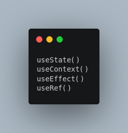
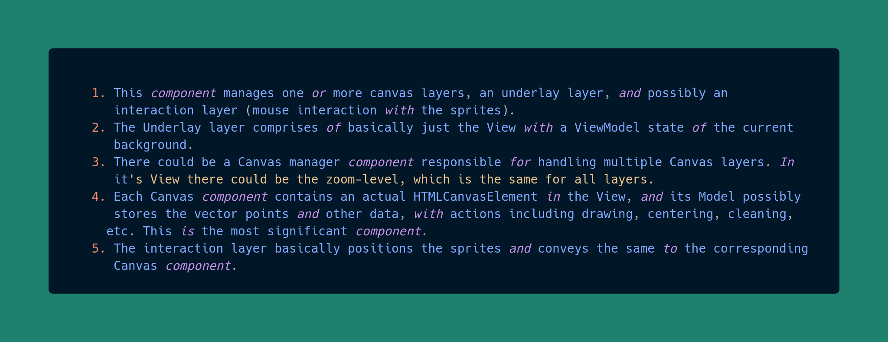
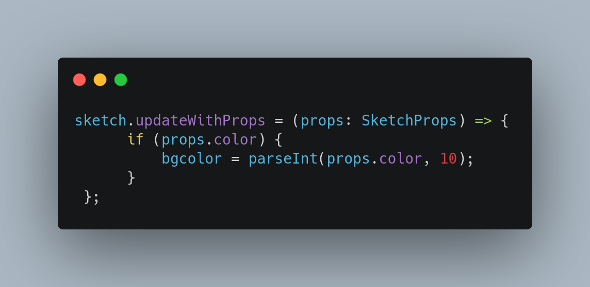
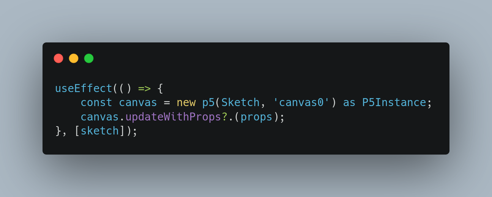
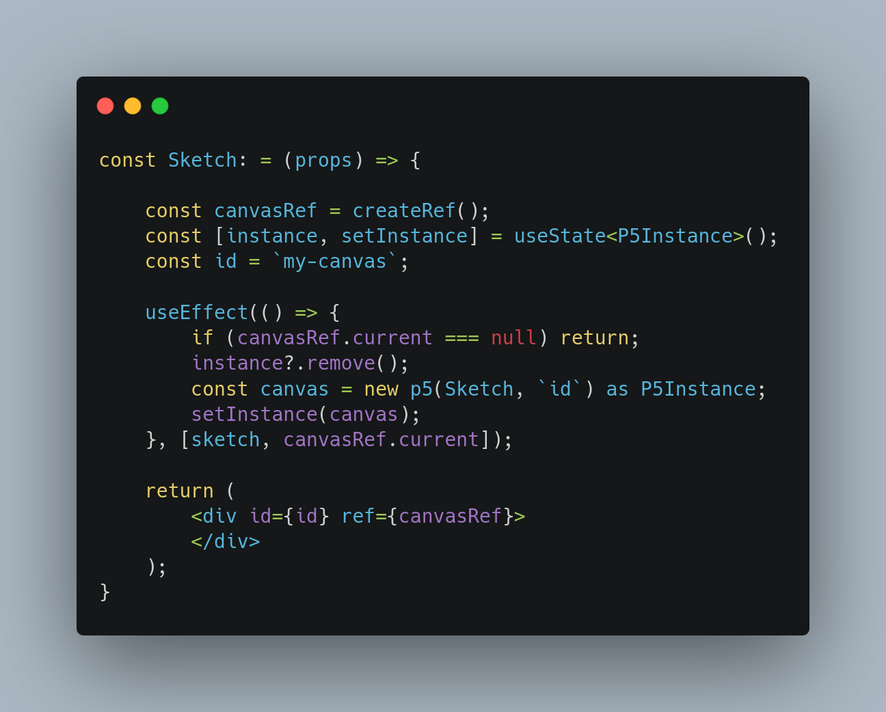
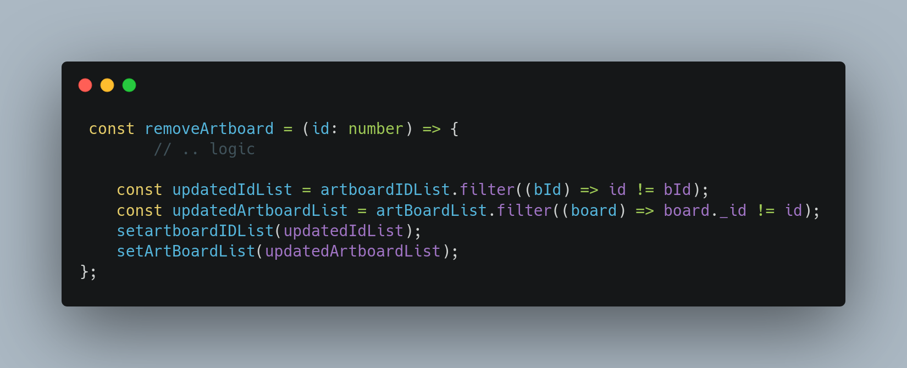

# Google Summer of Code 2021 Final report

## Title - Music Blocks Graphics Management

### Organization - Sugarlabs

This is a description of my work on
[Graphics Management](https://summerofcode.withgoogle.com/projects/#5670669326483456)
during *Google Summer of Code 2021* with
[Sugar Labs](https://github.com/sugarlabs/). This repository contains
[links](./authored-files/), samples of my work, and
examples.The code for artboard management and canvas generated using p5 is present in [authored files](./authored-files).
 

## 📙 Abstract

The aim of [*Music Blocks*](https://musicblocks.sugarlabs.org/) is to teach
beginners how to program, using a snap-together block-based instructions to
create music. The purpose of my project is **to develop a framework to draw and manage graphics which will be generated JavaScript code, and how we can use modern artistic library p5.js in our project to support more complex drawings. It also aimed to extend support for more turtles without loss in performance**.
 

## 📝 Tech Stack

I've used **React, p5.js and TypeScript** upto the **ECMAScript 8 (2017)** specification widely
relying on *ES6* `classes`, `let`/`const`, `arrow functions`, `syntactical feature` from *ES8*. In the manipulation 
of canvases generated using  *p5.js* - I required the use of
**React hooks** and **CSS**, and I used the *DOM* manipulation features of JavaScript
to interact with p5 sketches by wrapping it in a **React component**.

[**`React`**](https://reactjs.org/) is one of the most popular JavaScript libraries for creating single page applications.

[**`p5.js`**](https://p5js.org/) is a JavaScript library with a full set of drawing functionality.

[**`TypeScript`**](https://www.typescriptlang.org/) is an open-source language which builds on JavaScript, one of the world’s most used tools, by adding static type definitions.

In addition, for maintaining the `performance` of the application, many latest React features have been used:

The coding architecture followed is [`MVVM` **Model-View-ViewModel**](https://en.wikipedia.org/wiki/Model%E2%80%93view%E2%80%93viewmodel) 
for all the components. 

In the beginning, I explored many JavaScript library for drawing complex canvas graphics using React. Some of them includes 

<table>
     <th> 
        Libraries
    </th>
    <tr> 
        <td><a href="https://github.com/konvajs/react-konva" target="_top">react-konva</a></td>
    </tr>
    <tr> 
        <td><a href="http://paperjs.org/" target="_top">paper.js</a></td>
    </tr>
    <tr> 
        <td><a href="http://fabricjs.com/" target="_top">fabric.js</a></td>
    </tr>
    <tr> 
        <td><a href="https://www.npmjs.com/package/react-p5" target="_top">react-p5</a></td>
    </tr>
    <tr> 
        <td><a href="https://www.npmjs.com/package/react-p5-wrapper" target="_top">react-p5-wrapper</a></td>
    </tr>
</table>

Finally, I decided to go with **p5.js**. I have chosen this library because it is actively maintained and documentation is really helpful. It offers feature to integrate sound with the canvas too. The graphics can be handled more easily and it is beginner friendly. Many libraries I have found are written on top of **p5.js**, so why to use a library for that. I took help from `react-p5` and `react-p5-wrapper` for typescript support and intergration of p5 sketches with react without actually using them. This was the challenging part to establish a bidirectional communication between the main React app and sketches. 

 

## ✨ Work Progression

During the *community bonding period* I was assigned task to come up with a prototype for handling many sketches. I started exploring many Javascript library to manage canvas so that we donot need to write functions ourselves. I decided to go with **p5.js** as it comes up with many pre-defined functions to draw, design and handling canvases without loss in performance. My mentor also advised me to use some library to fasten our development as there is no need to waste time on writing those functions which someone has already written and tested.

This project was also dependent on the progress of other projects which are blocks refactoring, plattes and menu handling. Therefore, I progressed in small steps splitting the task across
multiple PRs. Throughout the ten weeks of the *coding period* , my major time goes in the experimenting with canvases and their performance, adding support for typescript, integrating other compnonets with the artboard manager component.

My work, basically, consisted of five major parts:
**Prototyping the Artbaord Framework**, **Communicating with p5 sketch back and forth**,
**Handle multiple sketches with objects efficiently**,**Integrating all dependent components together**, and **testing if it works as expected**.
Since, the restructuring was not possible to do linearly, I did it in multiple
turns.

## 📝 Prototyping the Artboard Framework

In **Musicblocks v3**, there is no proper canvas management system, however there are some files especially for handling turtle. This project was to come up with a dedicated module for artboard, hence I started working on the prototype for artboard framework. This was also the most challenging phase for me, as I have to start from scratch and design a proper file structure, understand the exact requirements, variables, sub components, how all of them will be structured. As Walter said, writing your fine line of code is always hard. I had a meeting with my mentor, he clearified all my doubts and also suggested possible prototypes along the lines of MVVM. 

`This issue addresses the barebones and utilities for artboard framework`:

 

<table>
    <tr>
        <td> 🐛 Issue </td> 
        <td> #58 </td>
        <td> <a href="https://github.com/sugarlabs/musicblocks-v4/issues/58" target="_top">Artboard Framework</a></td>
    </tr>
    <tr>
        <td> 🔀 PR </td> 
        <td> #71 </td>
        <td> <a href="https://github.com/sugarlabs/musicblocks-v4/pull/71" target="_top">Artboard Framework PR</a></td>
    </tr>
    <tr>
        <td> 🎉 Commits </td> 
        <td> 7 </td>
        <td> <a href="https://github.com/sugarlabs/musicblocks-v4/pull/71/commits" target="_top"> all-commits</a></td>
    </tr>
</table>

`There were total of seven commits which included adding artboard canvas with typescript support, p5 sketch in instance mode, etc.`

## 📝 Communication between p5 sketch and react

This part was partially done under the prototype, as the file structure was designed keeping in mind that p5 sketches need to be wrapped in react components.The basic idea is that the p5.js sketch is wrapped in a React component. **The data that comes into the sketch is passed on to this component as props**. Callbacks(React Hooks) are used to return information back from the sketch to the application. This specifically refers to handle multiple p5 sketches on the same screen. 

**There is one-to-one relation between artboard and turtle, i.e every artboard is associated with unique turtle.**

This idea helped in *generalisation* for message passing to each artboard from manager easy. Kudos to **JoyKirat Singh** fellow participant for writing all the draw functions keeping this architecture in mind.

Now anything that needs to be changed dynamically in p5 sketch can be passed as a **prop** to the sketch component and then add it as a dependency in useEffect hook for the sketch component. 

Now if the value of `prop` changes, the hooks `automatically` updates itself and changes gets reflected in the p5 sketch (as it is passed as a dependency) too. Using this, a `turtle` can draw arcs, lines,rotate at some degree,etc with a prop passed for each function. 

This also makes possible to `communicate` from sketch back to the application by changing the prop value. For example, if moving `turtle` needs to be stopped just set the prop for movement to false, it will stop moving. This is also possible due to hooks. 

<table>
<tr>
    <td><b>useRef()</b</td> 
    <td>For P5, we need to resort to instance mode and feed it a reference node.
We declare a reference variable called "canvasRef" using React's useRef hook. This just let's our p5 library have a node or reference insertion point. It's important that we pass "canvasRef.current" into our DOM function because ".current" gives the actual HTML node we want. And finally, we return some jsx of a div that has the ref attribute equal to the value of our useRef hook variable.</td>
</tr>
</table>      

This helps in wrapping up p5 sketch in a react component without losing unique reference to it in the DOM. This becomes crucial because we are handling multiple canvases simultaneously. For more detailed example refere [here](https://github.com/sugarlabs/musicblocks-v4/tree/p5-canvas-instance).  

## 📝 Handle multiple sketches with objects efficiently

The `manager component` can handle multiple sketches and turtles. It generates unique ids for each artboard sketch and use it to differentiate between them while sending signals. It stores the ids in a array of list. It also establish communication between artbaord components with other components with the help of **monitor component**. It can add a new artboard(canvas), remove an existing artboard, renders a particular turtle to draw on artboard, etc. It receives `signals` from monitor component to do a change in a particular artboard. It maintains a list of artboards which are currently present in the program. 

Let us see for e.g. how a particular artboard can be `removed`. As a matter of fact, we need to remove the artboard id and `artboard object` from Id list and Artboard list respectively. This logic is contained in the removeArtboard function.

Then register this function with the monitor like this - 

<table>
    <tr>
        <td> 🐛 Issue </td> 
        <td> #78 </td>
        <td> <a href="https://github.com/sugarlabs/musicblocks-v4/issues/78" target="_top">Artboard Manager Framework </a></td>
    </tr>
    <tr>
        <td> 🔀 PR </td> 
        <td> #80 </td>
        <td> <a href="https://github.com/sugarlabs/musicblocks-v4/pull/80" target="_top">Manager PR</a></td>
    </tr>
    <tr>
        <td> 🎉 Commits </td> 
        <td> 14 </td>
        <td> <a href="https://github.com/sugarlabs/musicblocks-v4/pull/80" target="_top"> all-commits</a></td>
    </tr>
</table>

There were total fourteen commits consisting of adding type definitions for artboards and its props, modifying sketches for turtle and artboard to recieve signal from manager, testing the artboard, refactoring, adding more variables to the model component of manager, etc. 

## 📝 Integrating all dependent components together

This can be divided into *two* sub parts. The *first* part is to integrate manager with other artboard components and *second* is to integrate it with monitor which will connect it with other components.
It was required that *the manager component* should also maintain a list of all the *turtles* with their own unique *id*, this list should match the ArtBoard list. 

For example, any insertion/deletion of any artboard in the list should also reflect in the turtle list.
This turtle list should be passed as a `prop` to `ArtBoardTurtle.tsx.` All the `n` turtles will be on the topmost canvas on a single canvas. Therefore to create n canvases we will require n artBoardSketch and 1 ArtBoardTurtle. These things are maintained by the *manager component*.
<table>
    <tr>
        <td> 🐛 Issue </td> 
        <td> #69 </td>
        <td> <a href="https://github.com/sugarlabs/musicblocks-v4/issues/69" target="_top">Manager and Monitor </a></td>
    </tr>
    <tr>
        <td> 🐛 Issue </td> 
        <td> #83 </td>
        <td> <a href="https://github.com/sugarlabs/musicblocks-v4/issues/83" target="_top"> Manager and Artboard Props</a></td>
    </tr>
    <tr>
        <td> 🔀 PR </td> 
        <td> #87 </td>
        <td> <a href="https://github.com/sugarlabs/musicblocks-v4/pull/87" target="_top">Artboard Manager and Monitor</a></td>
    </tr>
    <tr>
        <td> 🎉 Commits </td> 
        <td> 8 </td>
        <td> <a href="https://github.com/sugarlabs/musicblocks-v4/pull/87/commits" target="_top"> manager-monitor-commits</a></td>
    </tr>
</table>

There were a total of *eight* commits which include adding types and definitons for manager class in monitor, adding methods to `create`, `remove`, `update` artboards, etc.

## 🚀 Testing and Documentation

The last week was reserved for testing but I used to test my code after frequently before making any PR. Also, for a side note, I used to take notes, document every point during the daily meetups. These things really helped me in writing this report. Every file has a README.md file which contains all the documentation.

<table>
    <tr>
        <td> 🔀 PR </td> 
        <td> #89 </td>
        <td> <a href="https://github.com/sugarlabs/musicblocks-v4/pull/89" target="_top">Documenation for artboards</a></td>
    </tr>
</table>

## 📦 Demo

✨ Original Music Blocks

📚 Implemented prototypes

### ✨ Enhancements

There are many enhancements that can be done particularly to artboards. Currently we heavily use props and it renders frequently which affects the performance of the application. We can use **context hook**,**Hot module**, etc
to improve the performance. We can add features to save artworks in `png`, `svg` format.Just like `p5 wrapper` we can also put the code for art board in a separate utility. Check [here](https://github.com/Gherciu/react-p5/tree/main/src) for more details.

### 👨 Acknowledgements

On a final note, I am extremely grateful to my mentors, [Anindya Kundu](https://github.com/meganindya), [Walter Bender](https://web.media.mit.edu/~walter/), [Devin Ulibarri](https://github.com/pikurasa).I am also very thankful for their motivation which helped me in improving the quality of my code and helping me improve my soft skills.

I am thankful to my fellow GSoCers [Joykirat Singh](https://github.com/joykirat18), [[Daksh Doshi](https://github.com/daksh4469)] and [Saurabh](https://github.com/ksraj123/) for all their guidance and for reviewing my Pull requests.

Thanks to [Google](https://www.google.com/),[Sugarlabs](https://www.sugarlabs.org/) and [MusicBlocks](https://musicblocks.sugarlabs.org/) for this great opportunity.

Thanks

Chandan

